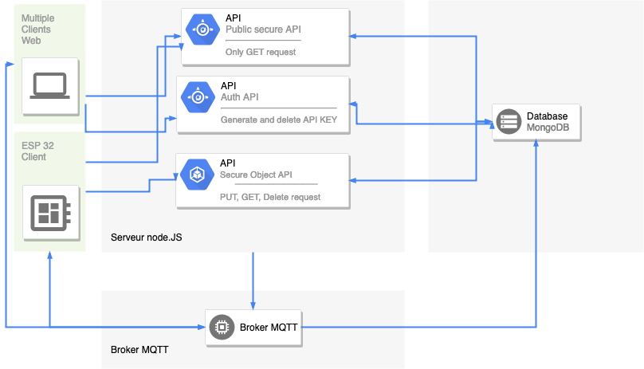

# Projet Arduino

## Fonctionnement du projet

### L'ESP 32

### Le serveur

Nous avons choisi de développer un serveur en node.JS. Nous avons fait ce choix car les serveurs node.JS sont rapides et simples à mettre en place.  
Nous avons couplé node.JS avec le framework express. Il facilite grandement la mise en place des routes, des droits d'accés au différents fichiers, le blocage de certaines methodes HTTP ou de certains headers.

Pour stocker les données nous avons utilisé MongoDB, car c'est un SGBD NoSQL, c'est pour nous l'occasion d'utiliser un SGBD que nous n'avons jamais utilisé.  
Uniquement le serveur node.JS pourra avoir accès à la base de données.  
Pour faire la connexion entre les deux, nous avons utilisé le framework Mongoose. Grâce à lui nous pouvons définir directement la structure des objets que l'on souhaite stocker dans notre code serveur et changer la structure des objets sans ce soucier de l'impact que ça aura sur notre BDD.

Notre serveur node.JS expose une API avec différentes routes. Pour accéder à cette API une clé d'api est nécessaire. Elle doit être placé dans le header des requetes.
Le routes qui permetent de modifier, ajouter et supprimer des données ne sont accéssibles que par l'ESP32 grâce à une clé d'api unique.

### Le broker MQTT

Nous avons choisi un broker MQTT privé. Ce broker possède trois topics:
* **led**: on y envoie le status de la LED, true pour l'allumer et false pour l'eteindre
* **lum**: l'esp 32 y envoie la valeur de son capteur de lumiere ;
* **temp**: l'esp 32 y envoie la valeur de son capteur de temperature.

Le serveur node.JS va s'abonner à ces différents topics et ajouter les données à la BDD dès qu'il en reçoit.

### Le client Web

Le client Web a été développé avec Angular 7. Deux dashboards sont disponibles.

Le dashboard HTTP, où toutes les données sont récupérées via HTTP. Des requetes sont effectuées toutes les secondes pour actualiser les données.

Le dashboard MQTT, il effectue dans un premier temps une requette HTTP pour initialiser les données sur l'interface. Ensuite il utilise MQTT pour les mettres à jour.


### Fonctionnement global

On peut traduire le fonctionnement global du projet à travers le schema suivant :



## Utiliser le projet 

Le projet est hébergé sur Heroku, un hebergement gratuit grâce au Github Student Pack.
L'adresse est la suivante: https://arduino-miage.herokuapp.com

La première fois que l'on veut accèder au client le chargement peut être long car le serveur sur lequel on héberge ce met en "pause" lorsqu'il ne recoit pas de requete pendant un certains temps.

L'api est disponible à l'adresse suivante: https://arduino-miage.herokuapp.com/api

## Api du serveur 

### Clé d'API
Pour accéder à l'api une clé est nécssaire. Pour la générer, il faut faire une requete à l'adresse suivante:

**post: auth/api_key** -> Retourne une clé d'api valide.

La clé doit être placée dans le header de toute les requêtes dans la valeur "x-api-key".

Il est possible de supprimer une clé d'api en faisant la requete suivante :

**post: auth/delete** -> Supprimer la clé d'api passé en paramètre via le champ "key".

### Routes
* **get: api/lumiere** -> Obtenir toute les valeurs de lumiere
* **get: api/lumiere/latest** -> Obtenir la derniere valeur insérée dans la BD
* **post: api/lumiere** -> Ajoute une valeur de lumière dans la BD, le body de la requete doit contenir la paramètre 'lumiere'
* **get: api/temperature** -> Obtenir toute les valeurs de temperature
* **get: api/temperature/latest** -> Obtenir la derniere valeur insérée dans la BD
* **post: api/temperature** -> Ajoute une valeur de temperature dans la BD, le body de la requete doit contenir la paramètre 'temperature'

Si la requête est bien executée un code HTTP 200 avec la réponse est renvoyé sinon une erreur HTTP avec le code erreur correspondant est renvoyée.

## Broker MQTT

Pour utiliser MQTT nous avons utilisé un broker privé accessible ici:
* **Server**: m24.cloudmqtt.com
* **Port**: 38060
* **Username**: jpuqjxky
* **Password**: AtH50qUjgJjR

## Lancer le projet en local

### Installation 

Pour pouvoir faire fonctionner notre projet, il faut installer MongoDB, node.JS et Angular.

MongoDB et node.JS sont nécessaires au fonctionnent du serveur.

node.JS et Angular sont nécessaire au fonctionnement du client.

#### Installer MongoDB

Sur **macOS**: https://docs.mongodb.com/manual/tutorial/install-mongodb-on-os-x/  
Sur **Windows**: https://docs.mongodb.com/manual/tutorial/install-mongodb-on-windows/
Sur **Linux**: https://docs.mongodb.com/manual/administration/install-on-linux/

#### Installer node.JS

https://nodejs.org/en/download/

#### Installer Angular

Pour pouvoir installer Angular, il faut au préalable avoir installé node.JS:
https://angular.io/guide/quickstart

### Lancer le projet

#### Dans un premier terminal 

Lancer la commande

```
mongod
```

**Ne pas fermer ce terminal !**

#### Dans un second terminal
Dans le dossier server:
```
npm install
npm run dev
```

Le serveur est disponible à l'adresse: http://localhost:5000

#### Lancer le client 

Dans le dossier "client" du projet, dans un terminal lancer les commandes

```
npm install
npm run start
```

Le client est disponible à l'adresse suivante: http://localhost:4200/

Le client est fait pour fonctionner avec le server distant que nous avons hébergé sur Heroku à l'adresse suivante: https://arduino-miage.herokuapp.com  
Il est possible de faire fonctionner le client avec un serveur local. Pour cela, dans le fichier **client/src/environments/environment.ts** il faut mettre le champ **'apiUrl'** à **'http://localhost:5000/api'**
